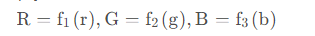
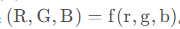

## 介绍

- LUT滤镜是一种基于颜色查找表（Look-Up Table，LUT）的图像处理技术，它可以实现各种视觉效果，如色调、对比度、饱和度、锐度、曝光度等。LUT滤镜的实现原理是通过查找表查找对应的颜色值，并将其应用到图像上。
- 其原理本质上就是一个映射关系，输入颜色 (r, g, b)，通过 LUT 去查找，得到一个新的颜色 (R, G, B)
  
## 分类
###  1D lut
1D LUT 是指 R, G, B 三个分量互相不影响，都是独立映射

###  3D lut
而 3D LUT 则是存在一个映射关系