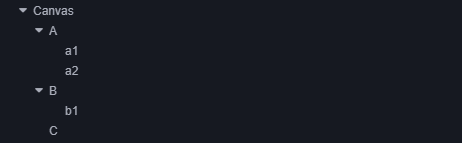
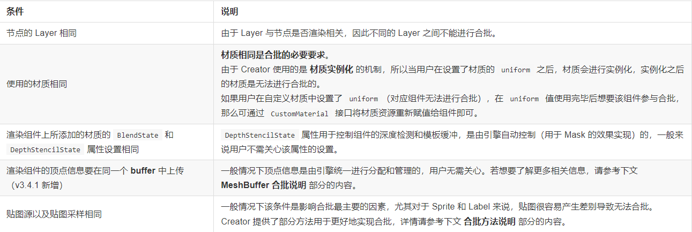

## 2D 渲染节点排序
### 2D 渲染节点可分为在 Canvas 下的节点和不在 Canvas 下的节点两种：

- 在 Canvas 下的节点可参考下文 UI 节点排序 部分的内容。

- 不在 Canvas 下的节点，用户可选择通过 自定义材质 来开启深度检测实现和 3D 物体的遮挡显示，开启后会按照物体的 Z 轴坐标进行遮挡渲染（可参考范例 2d-rendering-in-3d（GitHub | Gitee）。

## 渲染顺序

上图中整体的渲染顺序则是：A -> a1 -> a2 -> B -> b1 -> C，在屏幕上的呈现状态为：C -> b1 -> B -> a2 -> a1 -> A 即 从上往下。

## 相机ClearFlag 


## 合批  
   

### 无法合批组件  
- 内置组件 Mask、Graphics 和 UIMeshRenderer 组件由于材质不同和数据组织方式的差异，无法与其他组件合批；
- TiledMap、Spine 和 DragonBones 这三个中间件组件则是遵循自己的内部合批机制。  

## 渲染纹理
渲染纹理是一张在 GPU 上的纹理。通常我们会把它设置到相机的 目标纹理 上，使相机照射的内容通过离屏的 frambuffer 绘制到该纹理上。一般可用于制作汽车后视镜，动态阴影等功能。

## 材质属性设置

设置uniform变量
```ts
mat.setProperty("uniform name", uniformValue)
```
