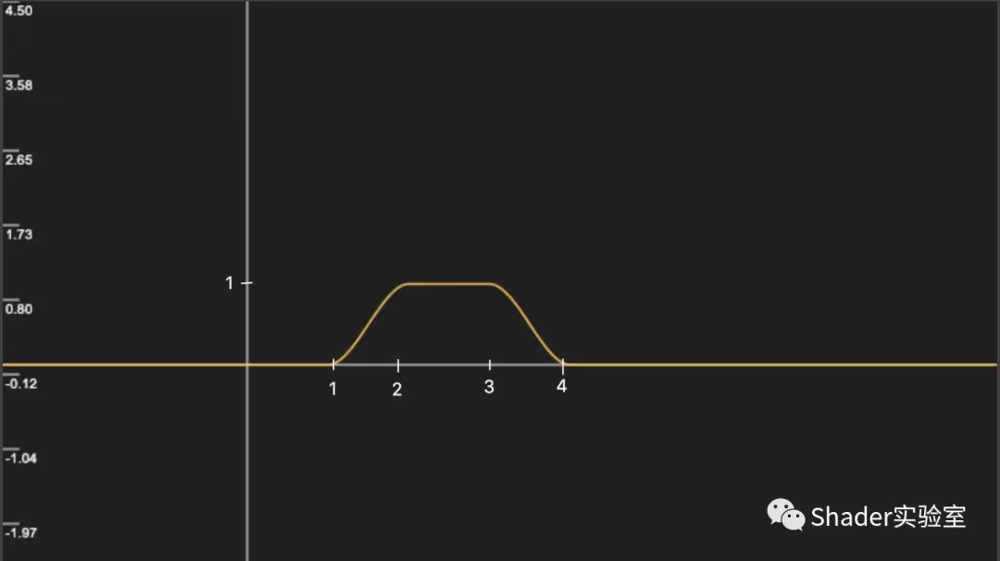

### smoothstep
- smoothstep可以用来生成0到1的平滑过渡值，它也叫平滑阶梯函数
{:height="600px" width="600px"}

```glsl
float smoothstep(float t1, float t2, float x) {
  // Scale, bias and saturate x to 0..1 range
  // 还记得么？在remap算法中接触过
  x = clamp((x - t1) / (t2 - t1), 0.0, 1.0); 
  // Evaluate polynomial
  return x * x * (3 - 2 * x);
}
```

### step
- step(a, b);当b > a时， 返回1；当b < a时，返回0
```glsl
float step(float a, float x)
{
    if (a < x)
    {
        return x;
    }
    else
    {
        return a;
    }
}
```

### MIX
```glsl
vec4 mix(vec4 colorA, vec4 colorB, float a)
{
    return x * (1 - a) + y * a;
}
```