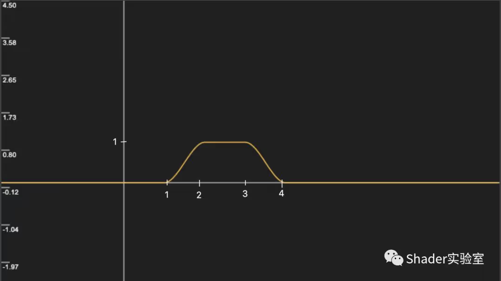

### smoothstep
- smoothstep可以用来生成0到1的平滑过渡值，它也叫平滑阶梯函数
- smoothstep(edg0, edg1, x); edg0左边缘，edg1右边缘，使x在edg0和edg1区间内进行平滑处理。返回值在[0， 1]区间内，当x > edg1时，返回1，当x < edg0时，返回0，当x在edg0和edg1之间时，返回x


```glsl
float smoothstep(float t1, float t2, float x) {
  // Scale, bias and saturate x to 0..1 range
  // 还记得么？在remap算法中接触过
  x = clamp((x - t1) / (t2 - t1), 0.0, 1.0); 
  // Evaluate polynomial
  return x * x * (3 - 2 * x);
}
```

### step
- step(a, b);当b > a时， 返回1；当b < a时，返回0
```glsl
float step(float a, float b)
{
    if (b < a)
    {
        return 1;
    }
    else
    {
        return 0;
    }
}
```

### MIX
```glsl
vec4 mix(vec4 colorA, vec4 colorB, float a)
{
    return colorA * (1 - a) + colorB * a;
}
```