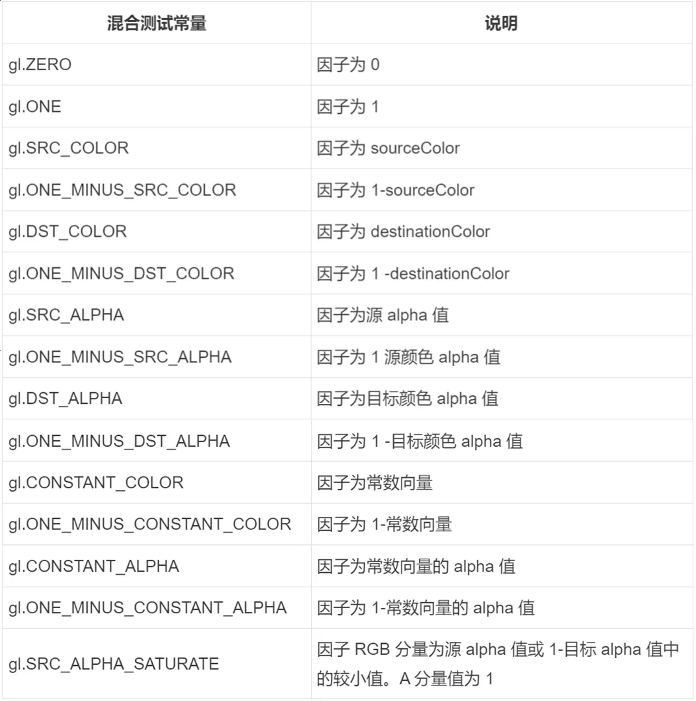
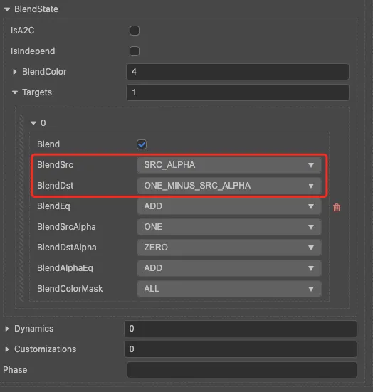
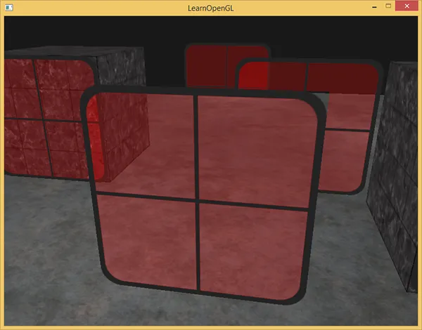

## 透明度测试

- 如果不对透明纹素进行处理的话，默认就会取纹素自带的颜色呈现，如下图：

### 解决

#### discard
- 定义一个阈值 小于阈值就调用discard; 缺点: 但是我们可能需要多个透明物体之间相互作用的效果 这种方式不能满足

#### 混合
- 启用混合时需要关闭深度测试

**混合方程**
__color(RGBA) = ((sourceColor * sfactor) + (destinationColor * dfactor)). RBGA__
- sourceColor：源颜色向量。这是源自纹理的颜色向量。
- destinationColor：目标颜色向量。这是当前储存在颜色缓冲中的颜色向量。
- sfactor：源因子值。指定了 alpha 值对源颜色的影响。
- dfactor：目标因子值。指定了 alpha 值对目标颜色的影响。

**因子设置表**

**混合设置**

***方程表示为（这里的源使用 50%  透明度区域(0.9, 0, 0.6, 0.5)，颜色缓冲假设是纯绿色(0, 1, 0, 1)）:***
- color(RGB) = (0.9, 0, 0.6) * 0.5 + (0, 1, 0) * (1 - 0.5)
- 
- 
- color(A) = 0.5 * 1 + 1 * 0

##### 问题
先渲染了一个半透明物体（半透明物体距离相机更近），再渲染一个不透明物体（不透明物体距离相机更远）:

##### 解决如下：

- 先绘制所有不透明的物体；
- 对所有透明的物体排序，采用的是观察者视角，即距离相机的远近，“大多数”情况下，不开启深度测试；
- 按照从远到近的顺序绘制透明物体。

