## 渲染介绍

### ui shader 支持 UGUI 的 Mask 功能
添加一下代码 
``` GLSL
Shader "xxxxxx"
{
Properties
{
......

//MASK SUPPORT ADD
_StencilComp ("Stencil Comparison", Float) = 8
_Stencil ("Stencil ID", Float) = 0
_StencilOp ("Stencil Operation", Float) = 0
_StencilWriteMask ("Stencil Write Mask", Float) = 255
_StencilReadMask ("Stencil Read Mask", Float) = 255
_ColorMask ("Color Mask", Float) = 15
//MASK SUPPORT END

}

SubShader
{
Tags {...}

//MASK SUPPORT ADD
Stencil
{
    Ref [_Stencil]
    Comp [_StencilComp]
    Pass [_StencilOp] 
    ReadMask [_StencilReadMask]
    WriteMask [_StencilWriteMask]
}
ColorMask [_ColorMask]
//MASK SUPPORT END

......
}
}
```

### 顶点处理 vert

### 光栅化
将面转化为像素
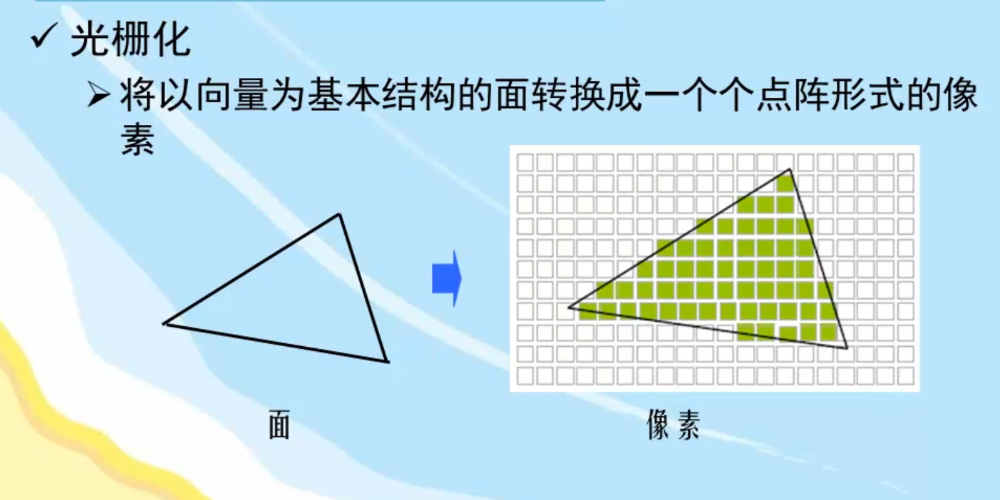


### 像素处理 frag
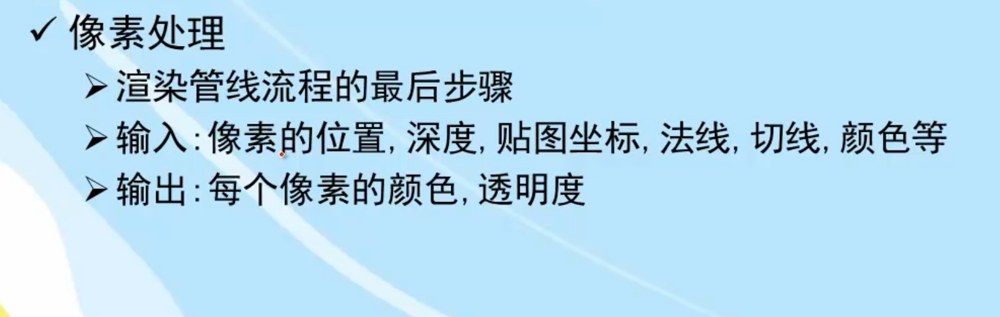

### 渲染管线四步骤
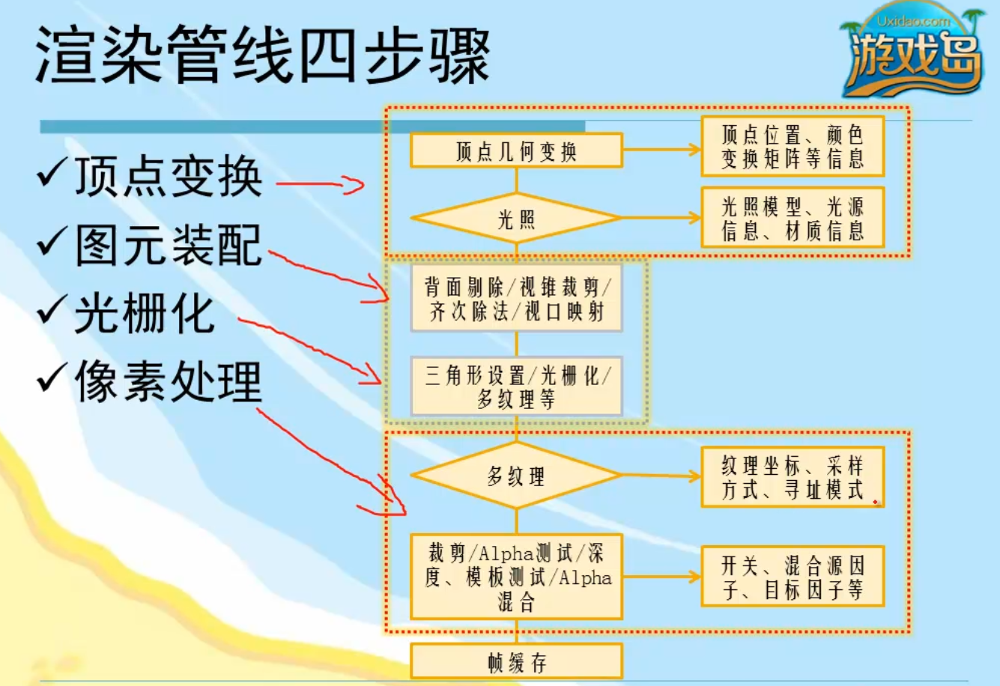 


## 开发工具 

- FX Composer
- Render Monkey
- MonoDevelop
- vs

## 框架
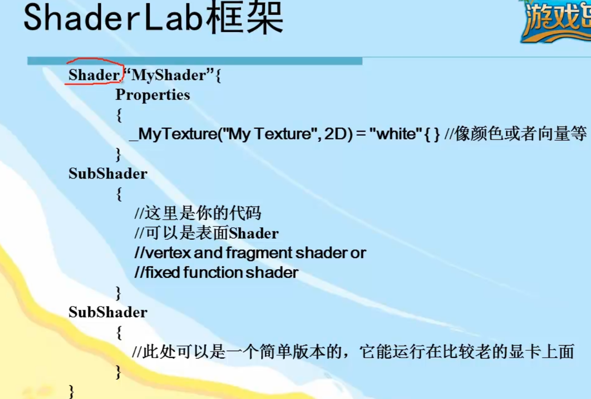
  
## Properties 属性
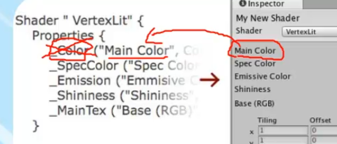
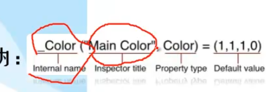

- Color
- Range
- 2D
- Rect
- Cube
- Float
- Vector 
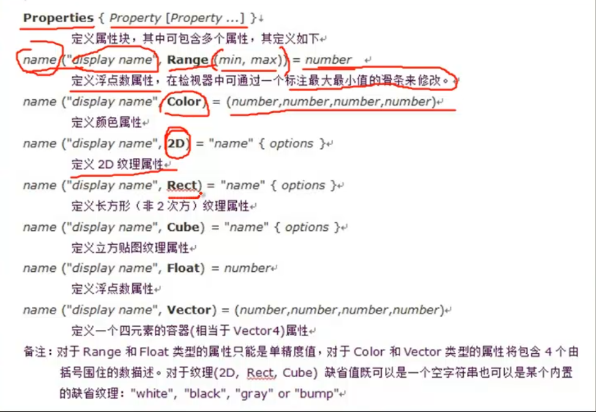

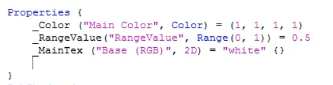

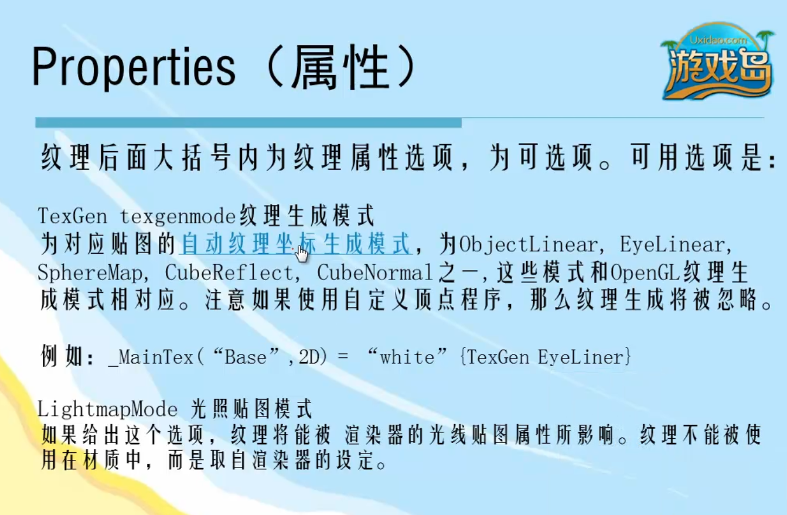


## SubShader
- shader的代码实现
- 必须至少有一个subshader


###  多个SubShader
- 多个SubShader下 会按顺序执行其中能执行的一个 有且仅有一个

### FallBack
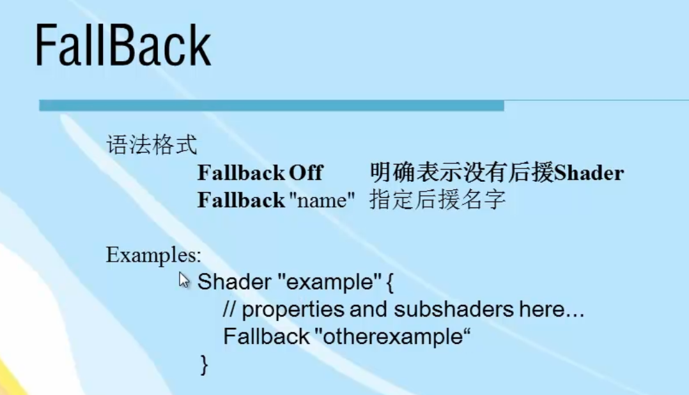

### Tags
#### Queue 渲染顺序
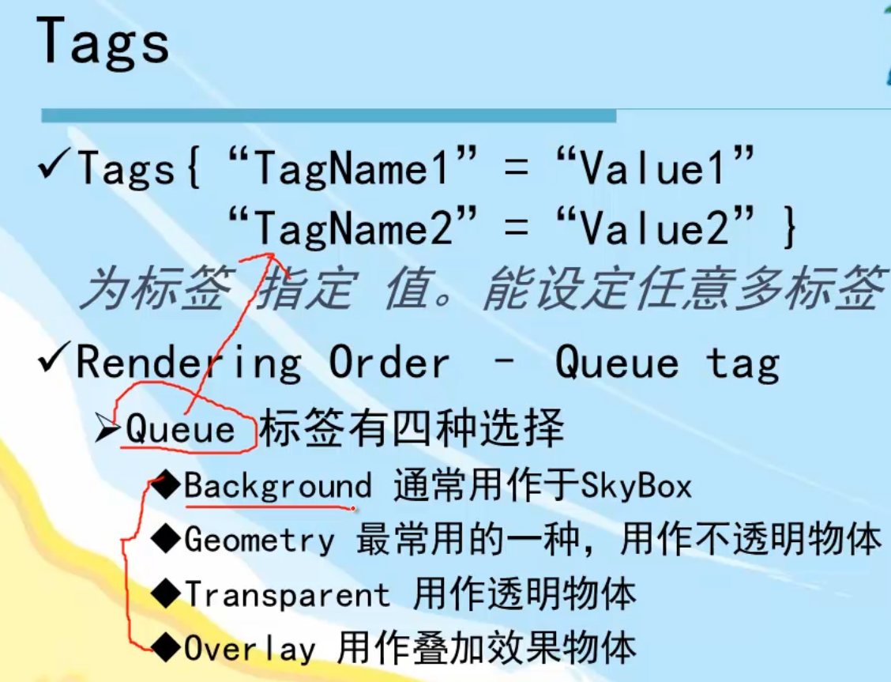
- Background 第一个渲染
- Geometry 几何体 第二个渲染
- Transparent 第三个渲染
- Overlay 第四个渲染

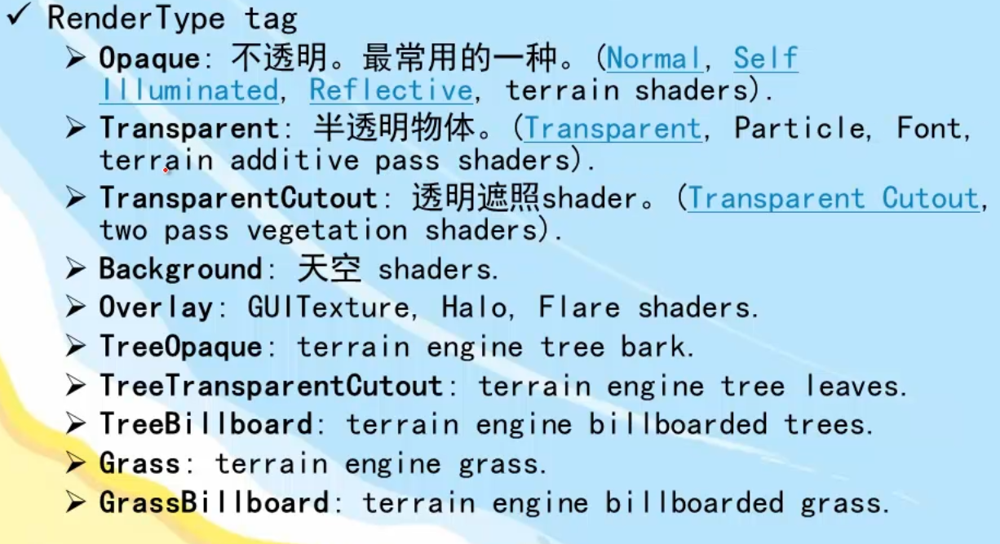
#### 用法
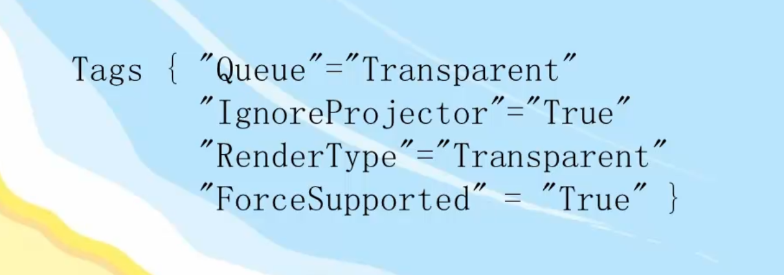

### renderState
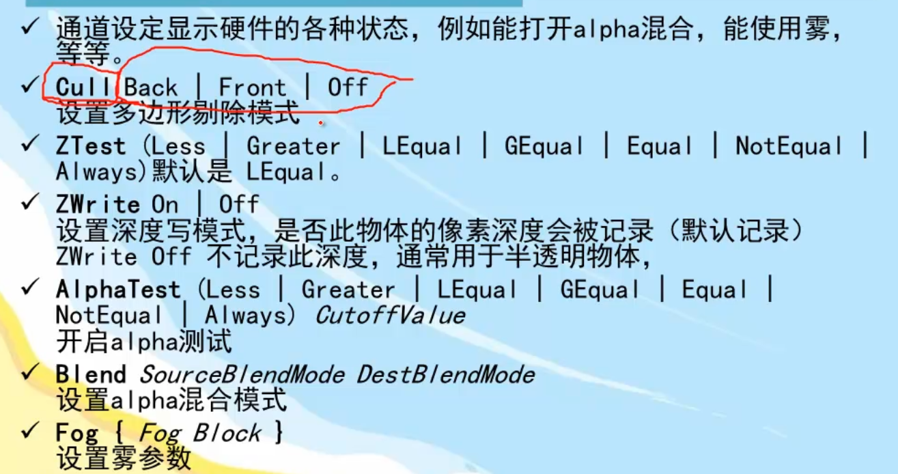
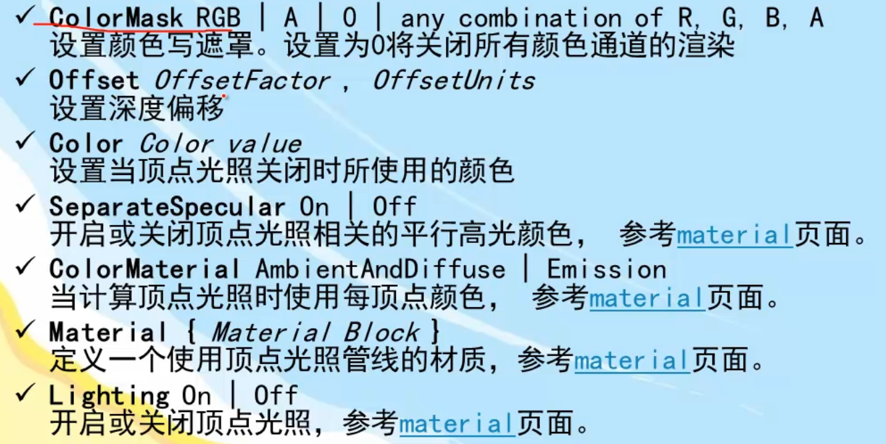
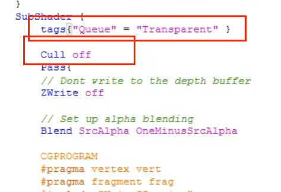


#### Blend 混合
One 值为1 让源或目标颜色完全通过
Zero 删除源或目标颜色
SrcColor 乘以源颜色的值
SrcAlpha 乘以源颜色的alpha值
DstColor 乘以帧缓冲区源颜色的值
  
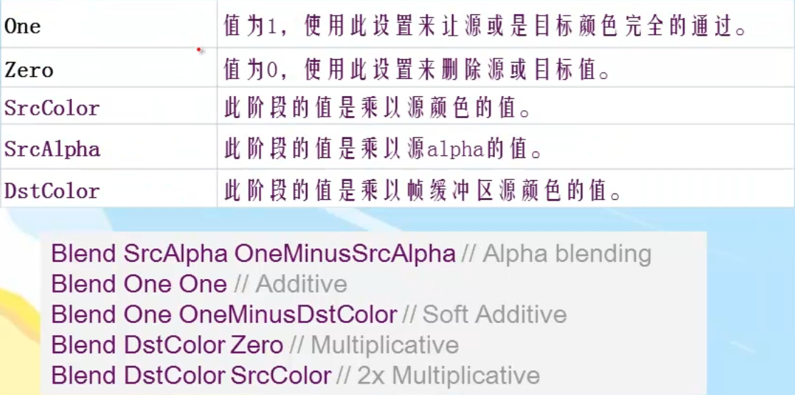
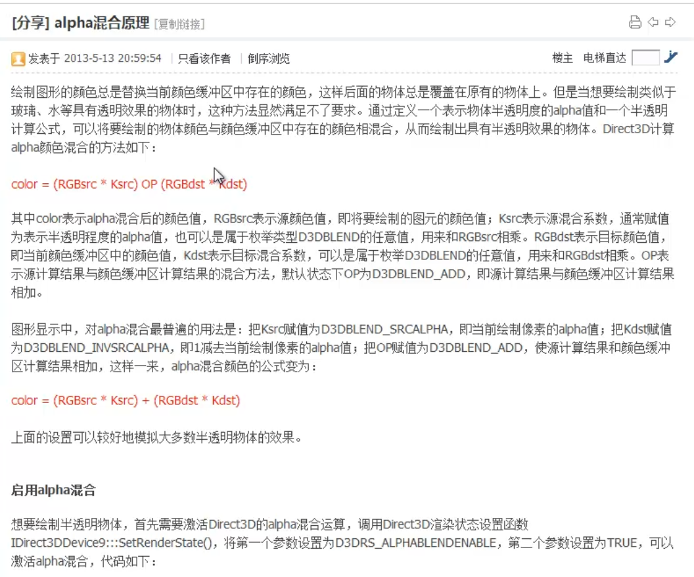

```GLSL
Shader "MyShader/RenderPipeline" {
	
	Properties {
		_Color ("Main Color", Color) = (1, 1, 1, 1)
		_RangeValue("RangeValue", Range(0, 1)) = 0.5
		_CutOut("Cutout", Range(0,1)) = 0.4
		_MainTex ("Base (RGB)", 2D) = "white" {}
		_CubeMap ("Cube Map", Cube) = "" {}
		_FloatValue ( "FloatValue", float) = 100 
		_VectorValue( "VectorValue", vector) = (1,1,1,1)
	}
	SubShader {
		tags{"Queue" = "Transparent" }
		
		Cull off
		ColorMask RGB
		//AlphaTest Less[_CutOut]
		Pass{
		// Dont write to the depth buffer
		ZWrite off

		// Set up alpha blending
		//Blend SrcAlpha OneMinusSrcAlpha

		CGPROGRAM
		#pragma vertex vert
		#pragma fragment frag
		#include "UnityCG.cginc"

		sampler2D _MainTex;
		float4 _Color;

		struct v2f{
			float4 pos:SV_POSITION;
			float4 texcoord : TEXCOORD0;
		};

		v2f vert(appdata_base v)
		{
			v2f o;
			o.pos = mul(UNITY_MATRIX_MVP, v.vertex);
			o.texcoord = v.texcoord;
			return o;
		}

		half4 frag(v2f i):COLOR0
		{
			half4 col = _Color * tex2D(_MainTex, i.texcoord.xy);
			return col;
		}

		ENDCG
		}
		

	} 

	
	FallBack "Diffuse"
}

```


### pass (通道)
SubShader下必须有pass
可以包含多个pass
每个pass都会运行

#### Tags
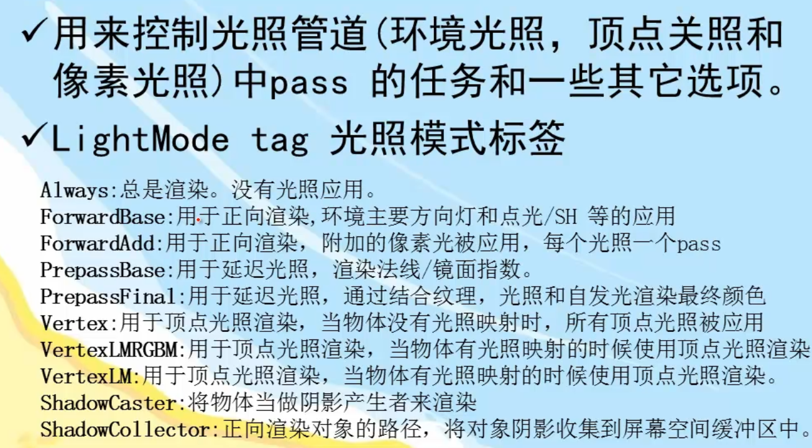