## Lambert 光照 (漫反射)
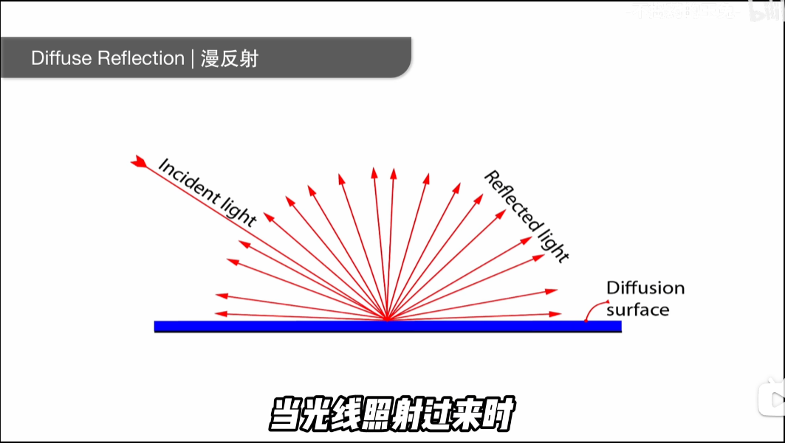

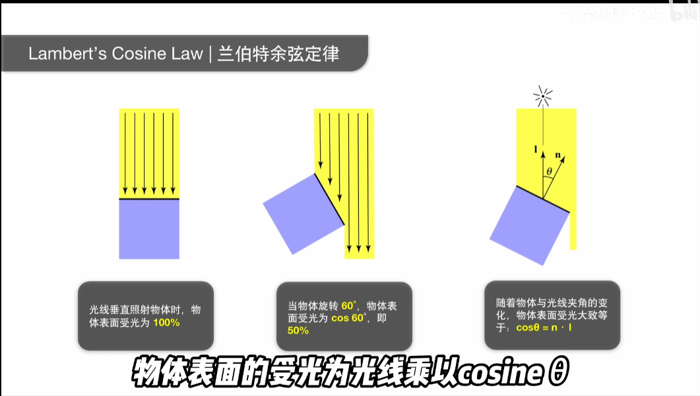

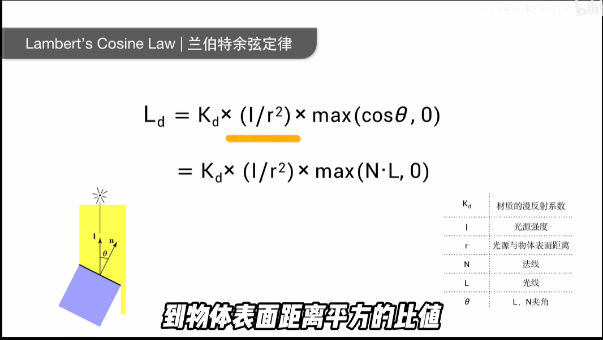

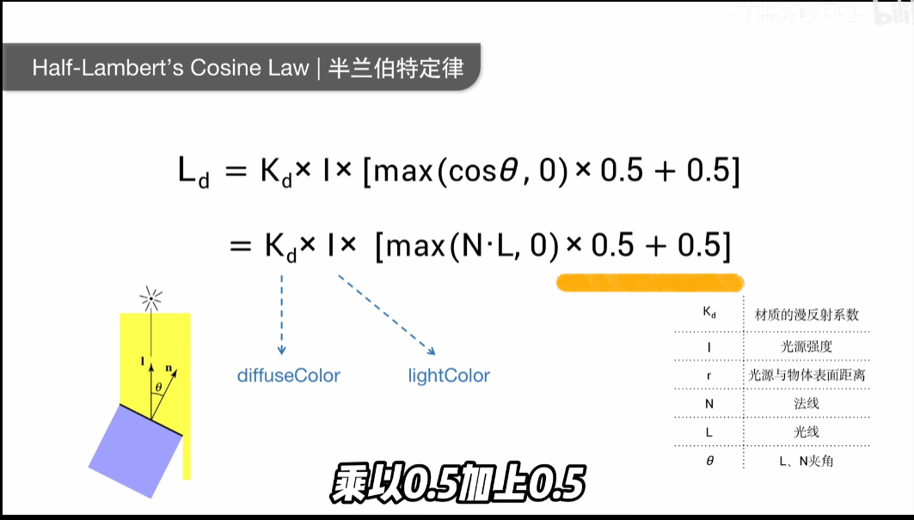

## Phone 光照

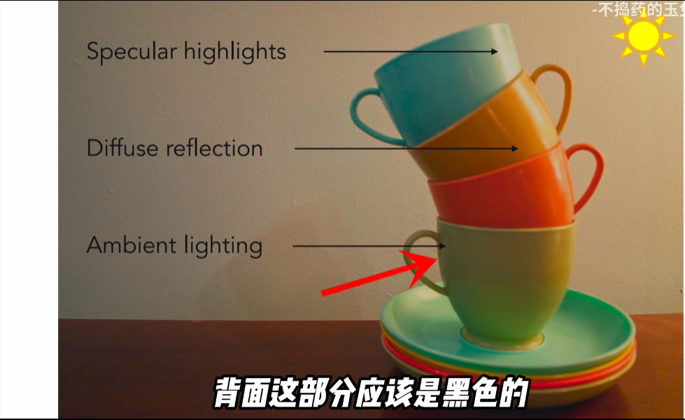
### 环境光
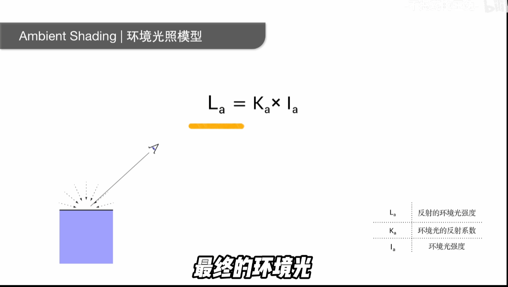
### 漫反射

### 高光反射
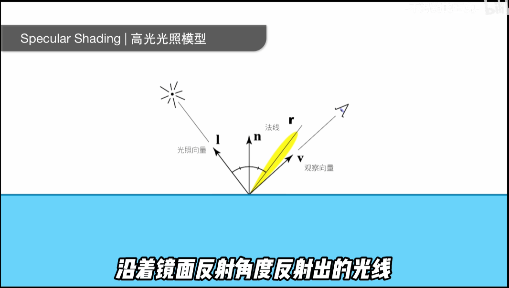
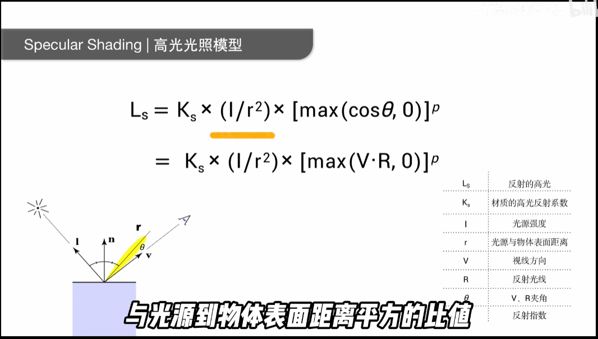

### Blinn-Phone模型
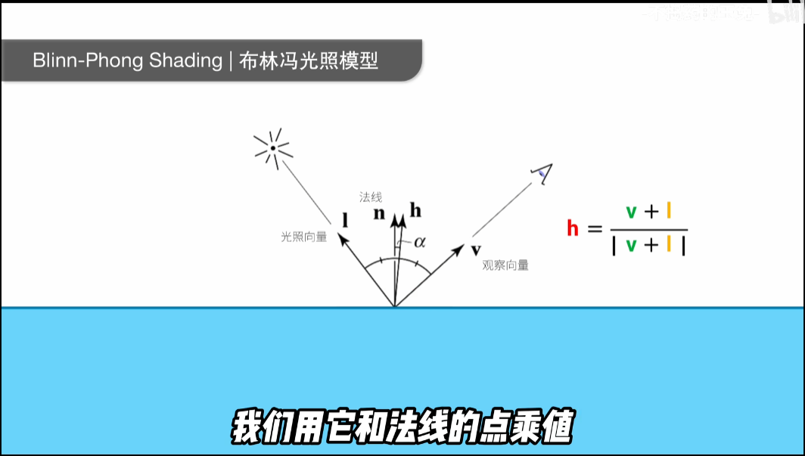

## 总结
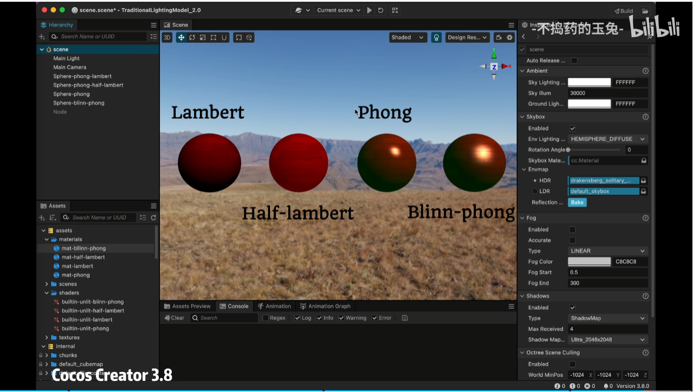

- Lambert和half-Lambert 都是只计算漫反射

- half-Lambert在Lambert基础上进行了亮度提升

- phone => 环境光+ 漫反射 + 高光反射

- Blinn-phone => 在phone模型基础上对高光计算改进 引入半程向量 让高光计算变得更加柔和自然

### GPT总结
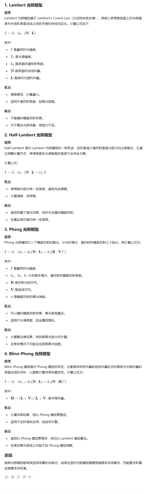

## 拓展PBR