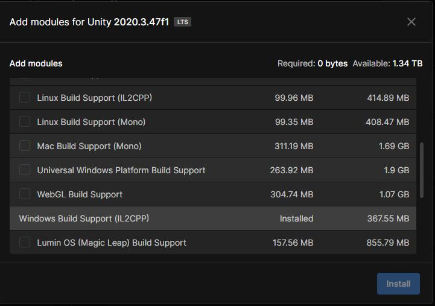
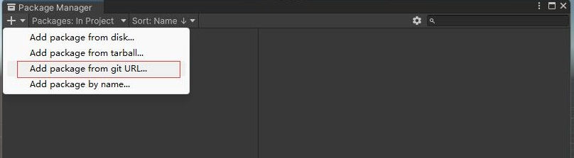
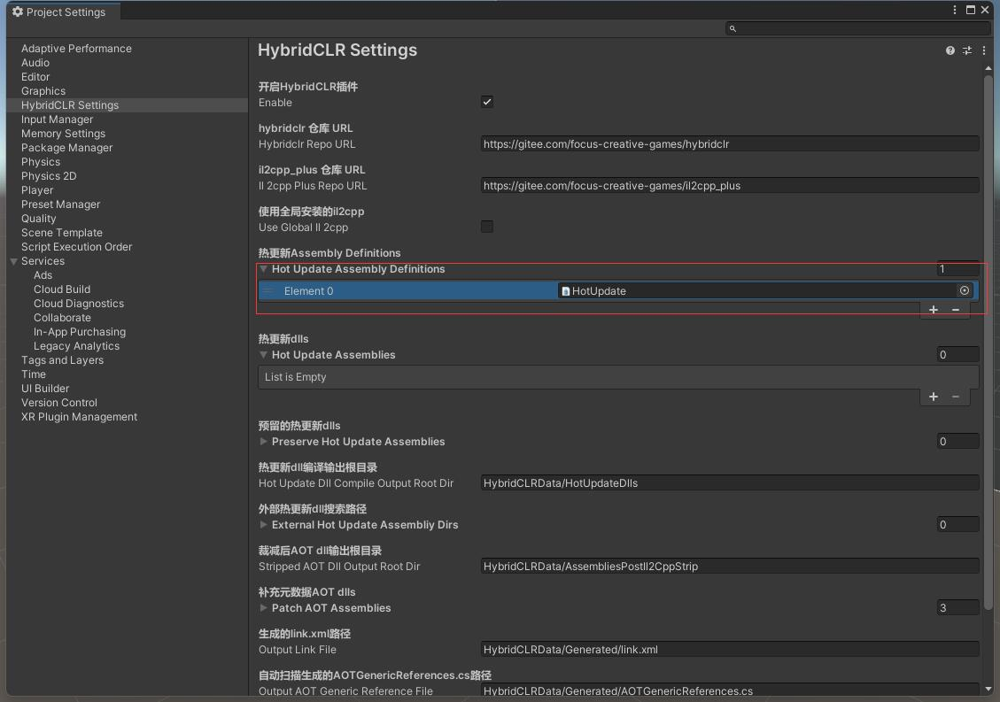
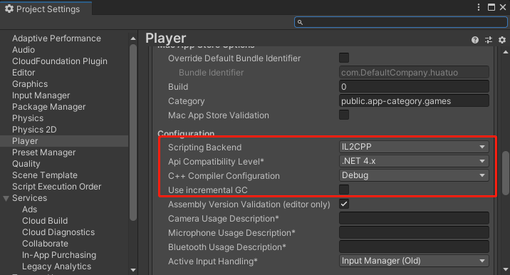

## 支持unity版本
- 2019.4.40、2020.3.26+、 2021.3.0+、2022.3.0+

## 使用步骤

### 安装IL2CPP


### 安装 com.code-philosophy.hybridclr 包
- https://gitee.com/focus-creative-games/hybridclr_unity.git 或 https://github.com/focus-creative-games/hybridclr_unity.git


### 初始化 com.code-philosophy.hybridclr
- 打开菜单HybridCLR/Installer...

### 配置HybridCLR


### 配置PlayerSettings


### 调用热更新代码
```Csharp
void Start()
{
    // Editor环境下，HotUpdate.dll.bytes已经被自动加载，不需要加载，重复加载反而会出问题。
#if !UNITY_EDITOR
    Assembly hotUpdateAss = Assembly.Load(File.ReadAllBytes($"{Application.streamingAssetsPath}/HotUpdate.dll.bytes"));
#else
    // Editor下无需加载，直接查找获得HotUpdate程序集
    Assembly hotUpdateAss = System.AppDomain.CurrentDomain.GetAssemblies().First(a => a.GetName().Name == "HotUpdate");
#endif

    Type type = hotUpdateAss.GetType("Hello");
    type.GetMethod("Run").Invoke(null, null);
}

```

### 打包运行
- 运行菜单 HybridCLR/Generate/All 进行必要的生成操作。这一步不可遗漏!!!
- 将{proj}/HybridCLRData/HotUpdateDlls/StandaloneWindows64(MacOS下为StandaloneMacXxx)目录下的HotUpdate.dll复制到Assets/StreamingAssets/HotUpdate.dll.bytes，注意，要加.bytes后缀！！！
- 打开Build Settings对话框，点击Build And Run，打包并且运行热更新示例工程。