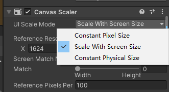
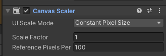
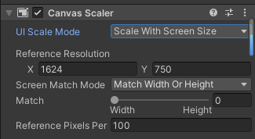
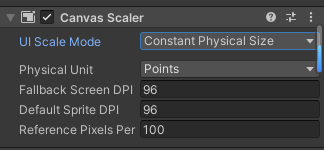

## Canvas Scaler
[官网](https://docs.unity3d.com/cn/current/Manual/script-CanvasScaler.html)

## 属性

| 属性：                 | 功能：                                                  |
| ---------------------- | ------------------------------------------------------- |
| UI Scale Mode          | 确定画布中的 UI 元素的缩放方式。                        |
| Constant Pixel Size    | 无论屏幕大小如何，UI 元素都保持相同的像素大小。         |
| Scale With Screen Size | 屏幕越大，UI 元素越大。                                 |
| Constant Physical Size | 无论屏幕大小和分辨率如何，UI 元素都保持相同的物理大小。 |

### Constant Pixel Size 的设置

| 属性：                    | 功能：                                                                          |
| ------------------------- | ------------------------------------------------------------------------------- |
| Scale Factor              | 按此系数缩放画布中的所有 UI 元素。                                              |
| Reference Pixels Per Unit | 如果精灵具有此“Pixels Per Unit”设置，则精灵中的每个像素将覆盖 UI 中的一个单位。 |

### Scale With Screen Size 的设置

| 属性：                    | 功能：                                                                              |
| ------------------------- | ----------------------------------------------------------------------------------- |
| Reference Resolution      | UI 布局设计的目标分辨率。如果屏幕分辨率较大，则 UI 会放大，如果较小，则 UI 会缩小。 |
| Screen Match Mode         | 在当前分辨率的宽高比不适应参考分辨率时，用于缩放画布区域的模式。                    |
| Match Width or Height     | 以宽度、高度或二者的某种平均值作为参考来缩放画布区域。                              |
| Expand                    | 水平或垂直扩展画布区域，使画布不会小于参考。                                        |
| Shrink                    | 水平或垂直裁剪画布区域，使画布不会大于参考。                                        |
| Match                     | 确定是否以宽度、高度或二者的某种平均值作为参考进行缩放。                            |
| Reference Pixels Per Unit | 如果精灵具有此“Pixels Per Unit”设置，则精灵中的每个像素将覆盖 UI 中的一个单位。     |

### Constant Physical Size 的设置：

| 属性：                    | 功能：                                                                                 |
| ------------------------- | -------------------------------------------------------------------------------------- |
| Physical Unit             | 用于指定位置和大小的物理单位。                                                         |
| Fallback Screen DPI       | 在屏幕 DPI 未知时采用的 DPI。                                                          |
| Default Sprite DPI        | 用于精灵的每英寸像素，使其“Pixels Per Unit”设置与“Reference Pixels Per Unit”设置匹配。 |
| Reference Pixels Per Unit | 如果精灵具有此“Pixels Per Unit”设置，则其 DPI 将与“Default Sprite DPI”设置匹配。       |

## World Space Canvas 的设置（画布 (Canvas) 组件设置为 World Space 时显示）：
| 属性：                    | 功能：                                                                                                                                                                |
| ------------------------- | --------------------------------------------------------------------------------------------------------------------------------------------------------------------- |
| Dynamic Pixels Per Unit   | 用于 UI 中动态创建的位图（如文本）的每单位像素量。                                                                                                                    |
| Reference Pixels Per Unit | 如果精灵具有此“Pixels Per Unit”设置，则精灵中的每个像素将覆盖世界中的一个单位。如果“Reference Pixels Per Unit”设置为 1，则精灵中的“Pixels Per Unit”设置将按原样使用。 |
