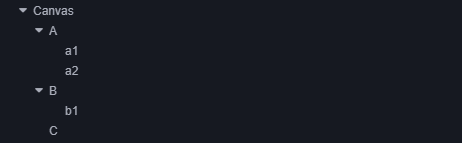

## 2D 渲染节点排序
### 2D 渲染节点可分为在 Canvas 下的节点和不在 Canvas 下的节点两种：

- 在 Canvas 下的节点可参考下文 UI 节点排序 部分的内容。

- 不在 Canvas 下的节点，用户可选择通过 自定义材质 来开启深度检测实现和 3D 物体的遮挡显示，开启后会按照物体的 Z 轴坐标进行遮挡渲染（可参考范例 2d-rendering-in-3d（GitHub | Gitee）。

## 渲染顺序

上图中整体的渲染顺序则是：A -> a1 -> a2 -> B -> b1 -> C，在屏幕上的呈现状态为：C -> b1 -> B -> a2 -> a1 -> A 即 从上往下。

## 相机ClearFlag

## 合批
