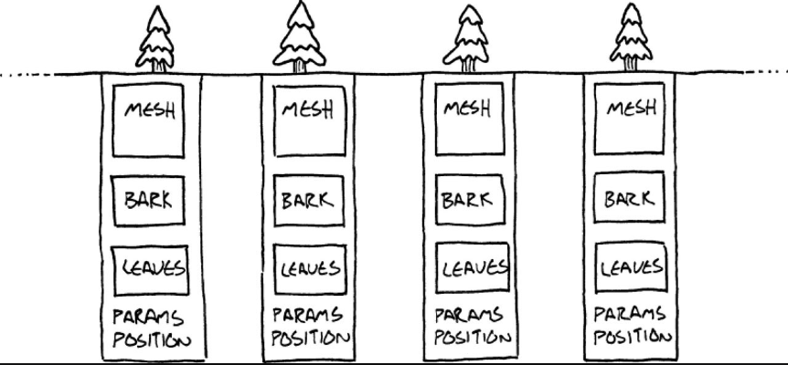
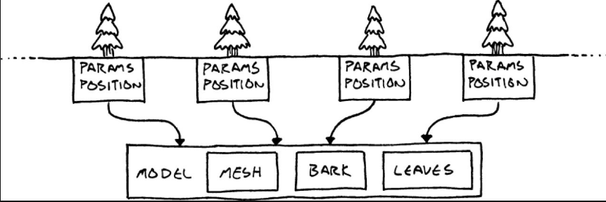
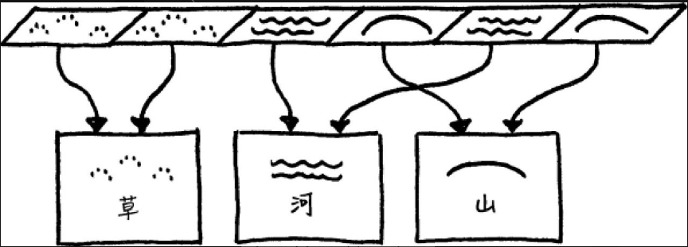

## 定义
使用共享高效地支持大量的细粒度对象

## 使用场景
广袤的森林树木 如果所有树木都单独享有数据内存占用无比巨大 并且这些数据在一帧内传入gpu完全不可能


小方框内的数据为同一份数据


我们可以把树木通用数据放到一个单独的类中
```c++
    class TreeModel
    {
    private:
      Mesh mesh_;
      Texture bark_;
      Texture leaves_;
    };


    class Tree
    {
    private:
      TreeModel* model_;

      Vector position_;
      double height_;
      double thickness_;
      Color barkTint_;
      Color leafTint_;
    };
```
整个游戏只需要一份这个数据所有的实例树都指向它 


看起来非常像类型对象模式。两者都是把部分状态给另一个由大量实例所共享的对象  但是两个模式背后的意图不同: 类型对象是减少定义新类型的数量  而享元是更注重执行效率
 
图例展示


### 地形例子
```c++
    class Terrain
    {
    public:
      Terrain(int movementCost, bool isWater,
             Texture texture)
      : moveCost_(moveCost),
        isWater_(isWater),
        texture_(texture)
      {}

      int getMoveCost() const { return moveCost_; }
      bool isWater() const { return isWater_; }
      const Texture& getTexture() const
      {
      return texture_;
      }

    private:
      int moveCost_;
      bool isWater_;
      Texture texture_;
    };

    class World
    {
        public:
        World()
        : grassTerrain_(1, false, GRASS_TEXTURE),
            hillTerrain_(3, false, HILL_TEXTURE),
            riverTerrain_(2, true, RIVER_TEXTURE)
        {}  
        
        // 地形生成
        void World::generateTerrain()
        {
            // Fill the ground with grass.
            for (int x = 0; x < WIDTH; x++)
            {
                for (int y = 0; y < HEIGHT; y++)
                {
                    // Sprinkle some hills.
                    if (random(10) == 0)
                    {
                        tiles_[x][y] = &hillTerrain_;
                    }
                    else
                    {
                    tiles_[x][y] = &grassTerrain_;
                    }
                }
            }

        // Lay a river.
        int x = random(WIDTH);
        for (int y = 0; y < HEIGHT; y++) {
        tiles_[x][y] = &riverTerrain_;
        }
    }

    const Terrain& World::getTile(int x, int y) const
    {
      return *tiles_[x][y];
    }

        private:
        Terrain grassTerrain_;
        Terrain hillTerrain_;
        Terrain riverTerrain_;
        // Other stuff...

        
    };

``` 
