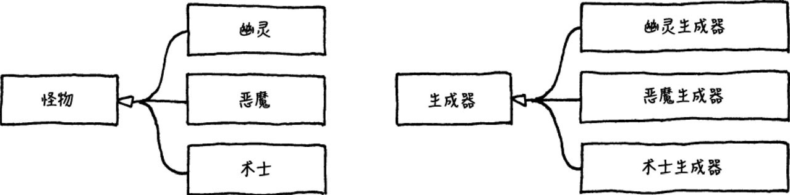

## 定义
使用特定原型实例来创建特定种类的对象，并且通过拷贝原型来创建新的对象

## 实例
假设要创建怪物 一般结构图如下


如图所示 每一种类型怪物都需要一个生成器 

使用原型模式 
```c++
class Monster
{
public:
    virtual ～Monster() {}
    virtual Monster* clone() = 0;

    // Other stuff...
};

class Ghost : public Monster {
public:
    Ghost(int health, int speed)
    : health_(health),
    speed_(speed)
    {}

    virtual Monster* clone()
    {
    return new Ghost(health_, speed_);
    }

private:
    int health_;
    int speed_;
};

// 生成器
class Spawner
{
public:
    Spawner(Monster* prototype)
    : prototype_(prototype)
    {}

    Monster* spawnMonster()
    {
    return prototype_->clone();
    }
private:
    Monster* prototype_;
};

// 实例化怪物生成器 可以创建多种生成器 虚弱 强壮 ...
Monster* ghostPrototype = new Ghost(15, 3);
Spawner* ghostSpawner = new Spawner(ghostPrototype);
```

### 问题
- 虽然我们不用再为每一种怪物类型创建单独的生成器了,但是我们需要为每一个怪物类实现clone()方法
- 深浅拷贝问题


## json数据配置中采用原型模式
- 降低数据量 降低数据大小

```JSON
// 没使用原型模式:
{
    "name": "goblin grunt",
    "minHealth": 20,
    "maxHealth": 30,
    "resists": ["cold", "poison"],
    "weaknesses": ["fire", "light"]
}

    {
    "name": "goblin wizard",
    "minHealth": 20,
    "maxHealth": 30,
    "resists": ["cold", "poison"],
    "weaknesses": ["fire", "light"],
    "spells": ["fire ball", "lightning bolt"]
}

{
    "name": "goblin archer",
    "minHealth": 20,
    "maxHealth": 30,
    "resists": ["cold", "poison"],
    "weaknesses": ["fire", "light"],
    "attacks": ["short bow"]
}

// 使用原型模式: 
{
    "name": "goblin grunt",
    "minHealth": 20,
    "maxHealth": 30,
    "resists": ["cold", "poison"],
    "weaknesses": ["fire", "light"]
}

{
    "name": "goblin wizard",
    "prototype": "goblin grunt",
    "spells": ["fire ball", "lightning bolt"]
}

{
    "name": "goblin archer",
    "prototype": "goblin grunt",
    "attacks": ["short bow"]
}
```