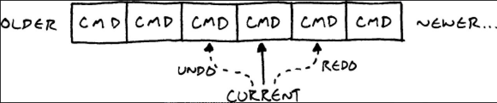

## 定义
将一个请求（request）封装成一个对象，从而允许你使用不同的请求、队列或日志将客户端参数化，同时支持请求操作的撤销与恢复。


简单概括就是: 把调用方法对象化(实例化)

```c++
    class Command
    {
    public:
      virtual ～Command() {}
      virtual void execute(GameActor& actor) = 0;

        Command* InputHandler::handleInput()
        {
            if (isPressed(BUTTON_X)) return buttonX_;
            if (isPressed(BUTTON_Y)) return buttonY_;
            if (isPressed(BUTTON_A)) return buttonA_;
            if (isPressed(BUTTON_B)) return buttonB_;

            // Nothing pressed, so do nothing.
            return NULL;
        }
    };


    class JumpCommand : public Command
    {
    public:
      virtual void execute(GameActor& actor)
      {
        actor.jump();
      }
    };


    Command* command = inputHandler.handleInput();
    if (command)
    {
      command->execute(actor);
    }

   

```

## 撤销和重做
- 命令模式的经典应用
```c++ 
    class MoveUnitCommand : public Command
    {
    public:
      MoveUnitCommand(Unit* unit, int x, int y)
      : unit_(unit), x_(x), y_(y)
        xBefore_(0), yBefore_(0),
      {}

      virtual void execute()
      {
        // Remember the unit's position before the move
        // so we can restore it.
        xBefore_ = unit_->x();
        yBefore_ = unit_->y();
        unit_->moveTo(x_, y_);
      }

      // 取消指令 撤回
      virtual void undo()
      {
        unit_->moveTo(xBefore_, yBefore_);
      }

    private:
      Unit* unit_;
      int x_, y_;
      // 保存上一次操作
      int xBefore_, yBefore_;
    };

```

### 多次撤回
只需要维护一个命令列表 按列表顺序撤回

