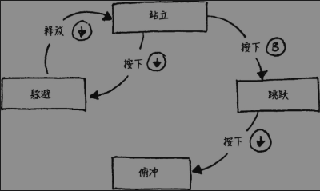
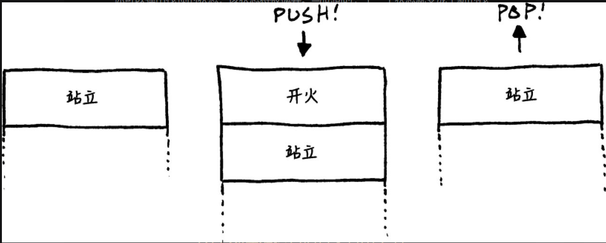

## 定义
允许一个对象在其内部状态改变时改变自身的行为。对象看起来好像是在修改自身类 

## 场景

### 需求中的问题
假设一个格斗游戏 通过按键实现跳跃 闪避 如果在地上 按方向键闪避 按b键跳跃 出现问:
如果没有其他比如是否在跳跃中 是否在地上的 状态控制的话 角色会有连续跳跃  空中闪避 空中站立的bug出现

### 解决: 有限状态机



意义:
- 你拥有一组状态，并且可以在这组状态之间进行切换
- 状态机同一时刻只能处于一种状态
- 状态机会接收一组输入或事件
- 每一个状态有一组转换，每一个转换都关联着一个输入并指向另一个状态


```c++
enum State
{
    STATE_STANDING,
    STATE_JUMPING,
    STATE_DUCKING,
    STATE_DIVING
};

class HeroineState
{
   public:
      static StandingState standing;
      static DuckingState ducking;
      static JumpingState jumping;
      static DivingState diving;

   public:
    virtual ～HeroineState() {}
    virtual void handleInput(Heroine& heroine,Input input) {}
    virtual void update(Heroine& heroine) {}
};

// 闪避状态
class DuckingState : public HeroineState
{
    public:
        DuckingState()
        : chargeTime_(0)
        {}

        virtual void handleInput(Heroine& heroine,
                                Input input) {
            if (input == RELEASE_DOWN)
            {
                // Change to standing state...
                heroine.setGraphics(IMAGE_STAND);
            }
        }

            virtual void update(Heroine& heroine) {
            chargeTime_++;
            if (chargeTime_ > MAX_CHARGE)
            {
                heroine.superBomb();
            }
        }

    private:
        int chargeTime_;
};

class Heroine
{
    public:
        virtual void handleInput(Input input)
        {
            state_->handleInput(*this, input);
        }

        virtual void update() { state_->update(*this); }

        // Other methods...
    private:
        // 当前状态
        HeroineState* state_;
};

```

#### 进入状态和退出状态

添加 enter 方法
```C++
    class StandingState : public HeroineState
    {
    public:
      virtual void enter(Heroine& heroine)
      {
        heroine.setGraphics(IMAGE_STAND);
      }

      // Other code...
    };

    void Heroine::handleInput(Input input)
    {
      HeroineState* state = state_->handleInput(
          *this, input);
      if (state ! = NULL)
      {
        delete state_;
        state_ = state;

        // Call the enter action on the new state.
        state_->enter(*this);
      }
    }

```

#### 缺陷
同一时刻只能有一种状态 局限性太大

### 并发状态机
定义多个状态机
```C++
    class Heroine
    {
      // Other code...

    private:
      HeroineState* state_;
      HeroineState* equipment_;
    };
```

功能更加完备的系统可能会让一个状态机来处理输入，以便另外一个状态机不会接收到输入。这样将能防止两个状态机对同一输入进行错误的响应


### 层次状态机
#### 场景
在我们把主角的行为更加具象化以后，她可能会包含大量相似的状态。比如，她可能有站立、走路、跑步和滑动状态。在这些状态中的任何一个状态时按下B键，我们的主角要跳跃；按下下方向键，我们的主角要躲避。

#### 定义
一个状态有一个父类, 事件传入如果子类不处理 事件沿着父类传递直到有父类处理或所有都不处理

```C++
class OnGroundState : public HeroineState
{
public:
    virtual void handleInput(Heroine& heroine,
                            Input input){
        {
            if (input == PRESS_B)  // Jump...
            else if (input == PRESS_DOWN)  // Duck...
        }
    }
};

// 后面所有类都继承至 OnGroundState
class DuckingState : public OnGroundState
{
public:
    virtual void handleInput(Heroine& heroine,
                            Input input)
    {
        if (input == RELEASE_DOWN)
        {
            // Stand up...
        }
        else
        {
            // Didn't handle input, so walk up hierarchy.
            OnGroundState::handleInput(heroine, input);
        }
    }
};
```

### 下推自动机

#### 例子
主角开枪的时候，我们需要一种新的状态来播放开枪的动画，发射子弹并显示一些特效。因此，我们需要定义一个FiringState，并且所有的状态都可以切换到这个状态，只要有玩家按下开火按键就行了。当她开完枪后，她要回到什么状态呢？主角可以处于站立、躲避、俯冲和跳跃状态。但开火的动画播放完以后，她应该要回到之前的状态。

#### 引入栈



## 总结
即使有了这些通用的状态机扩展，它们的使用范围仍然是有限的。在游戏的AI领域，最近的趋势是越来越倾向于行为树和规划系统。但是这并不意味着有限状态机、下推自动机和其他简单的状态机没有用。它们对于解决某些特定的问题是一个很好的建模工具。