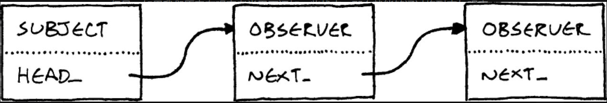

## 定义
在对象间提供一种一对多的依赖 以便在对象改变时依赖与此对象的对象能收到通知

```C++
    void Physics::updateEntity(Entity& entity)
    {
      bool wasOnSurface = entity.isOnSurface();
      entity.accelerate(GRAVITY);
      entity.update();
      if (wasOnSurface && ! entity.isOnSurface())
      {
        notify(entity, EVENT_START_FALL);
      }
    }

```

### 纯在问题
- 在多线程模式下 可能引起线程间的冲突
- 如果采用数组来存储观察者 容易产生 内存碎片化问题 影响超长时间游戏运行的效率


### 链式观察者
解决内存碎片问题

将存储观察者的数组替换为 链表

 


 ### 其余问题
1. 被观察者对象被删除时,观察者不知道 
解决: 在被观察者删除时发送死亡通知


2. 失效观察者: UI界面中注册观察,界面销毁没注销观察 


## 总结
观察者适合不相关的模块间进行通信