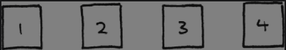
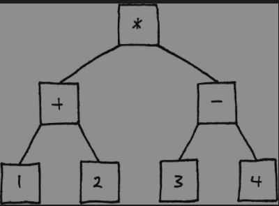

[显示器工作原理](https://zhuanlan.zhihu.com/p/351279020)


## 实例
计算下面式子
(1 + 2) * (3 - 4)





```c++
    class Expression
    {
    public:
      virtual ～Expression() {}
      virtual double evaluate() = 0;
    };

    // 数字解析器
        class NumberExpression : public Expression
    {
    public:
      NumberExpression(double value)
      : value_(value)
      {}

      virtual double evaluate()   { return value_;   }

    private:
      double value_;
    };

    // 加法解析器
        class AdditionExpression : public Expression
    {
    public:
      AdditionExpression(Expression* left,
                          Expression* right)
      : left_(left),
        right_(right)
      {}

      virtual double evaluate()
      {
        // Evaluate the operands.
        double left = left_->evaluate();
        double right = right_->evaluate();

        // Add them.
        return left + right;
      }

    private:
      Expression* left_;
      Expression* right_;
    };

```

## 缺点
慢！大部分广泛使用的编程语言没有基于解释器模式也正因于此。它太慢了，并且占用了大量的内存。