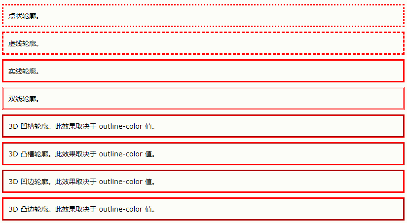
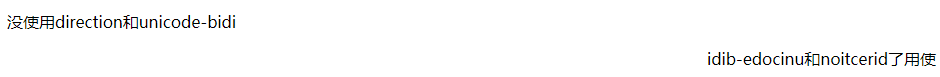
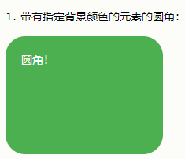
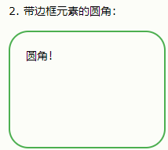
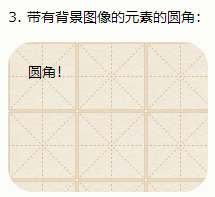

## 什么是

- CSS 是层叠样式表 (Cascading Style Sheets)
- CSS 描述了如何在屏幕、纸张或其他媒体上显示 HTML 元素

## 为何使用

- CSS 用于定义网页的样式，包括针对不同设备和屏幕尺寸的设计和布局。

## css 使用

**外部**

```css
<link rel="stylesheet" type="text/css" href="mystyle.css">
```

**内部**

```html
<!DOCTYPE html>
<html>
<head>
<style>
body {
  background-color: linen;
}

h1 {
  color: maroon;
  margin-left: 40px;
}
</style>
</head>
<body>

<h1>标题</h1>
< p>内容</p>

</body>
</html>
```

**行内**

```html
<!DOCTYPE html>
<html>
<body>

<h1 style="color:blue;text-align:center;">This is a heading</h1>
< p style="color:red;">This is a paragraph.</p>

</body>
</html>
```

### 样式叠加时优先级

- 行内样式（在 HTML 元素中）
- 外部和内部样式表（在 head 部分）
- 浏览器默认样式

## 选择器

### 种类

- 简单选择器（根据名称、id、类来选取元素）
- 组合器选择器（根据它们之间的特定关系来选取元素）
- 伪类选择器（根据特定状态选取元素）
- 伪元素选择器（选取元素的一部分并设置其样式）
- 属性选择器（根据属性或属性值来选取元素）

#### 元素选择器

- 根据元素名称来选择 HTML 元素

```css
/* 页面上的所有 < p> 元素都将居中对齐，并带有红色文本颜色 */
p {
  text-align: center;
  color: red;
}
```

#### id 选择器

- 使用 id 属性来选择元素

```css
/* id="para1" 的 HTML 元素 */
#para1 {
  text-align: center;
  color: red;
}
```

#### 类选择器

- 用类名来选择元素

```css
/* class="center" 的 HTML 元素 */
.center {
  text-align: center;
  color: red;
}
```

#### 通用选择器

- 所有的 HTML 元素

```css
* {
  text-align: center;
  color: blue;
}
```

#### 分组选择

- 例子

```css
h1,
h2,
p {
  text-align: center;
  color: red;
}
```

#### 伪类

- 定义元素的特殊状态

```css
/* 未访问的链接 */
a:link {
  color: #ff0000;
}

/* 已访问的链接 */
a:visited {
  color: #00ff00;
}

/* 鼠标悬停链接 */
a:hover {
  color: #ff00ff;
}

/* 已选择的链接 */
a:active {
  color: #0000ff;
}
```

##### 所有伪类

| 选择器               | 例子                  | 例子描述                                                           |
| -------------------- | --------------------- | ------------------------------------------------------------------ |
| :active              | a:active              | 选择活动的链接。                                                   |
| :checked             | input:checked         | 选择每个被选中的 \<input\> 元素。                                  |
| :disabled            | input:disabled        | 选择每个被禁用的 \<input\> 元素。                                  |
| :empty               | p:empty               | 选择没有子元素的每个 \< p\> 元素。                                 |
| :enabled             | input:enabled         | 选择每个已启用的 \<input\> 元素。                                  |
| :first-child         | p:first-child         | 选择作为其父的首个子元素的每个 \< p\> 元素。                       |
| :first-of-type       | p:first-of-type       | 选择作为其父的首个 \< p\> 元素的每个 \< p\> 元素。                 |
| :focus               | input:focus           | 选择获得焦点的 \<input\> 元素。                                    |
| :hover               | a:hover               | 选择鼠标悬停其上的链接。                                           |
| :in-range            | input:in-range        | 选择具有指定范围内的值的 \<input\> 元素。                          |
| :invalid             | input:invalid         | 选择所有具有无效值的 \<input\> 元素。                              |
| :lang(language)      | p:lang(it)            | 选择每个 lang 属性值以 "it" 开头的 \<\p\> 元素。                   |
| :last-child          | p:last-child          | 选择作为其父的最后一个子元素的每个 \< p\> 元素。                   |
| :last-of-type        | p:last-of-type        | 选择作为其父的最后一个 \< p\> 元素的每个 \< p\> 元素。             |
| :link                | a:link                | 选择所有未被访问的链接。                                           |
| :not(selector)       | :not(p)               | 选择每个非 \< p\> 元素的元素。                                     |
| :nth-child(n)        | p:nth-child(2)        | 选择作为其父的第二个子元素的每个 \< p\> 元素。                     |
| :nth-last-child(n)   | p:nth-last-child(2)   | 选择作为父的第二个子元素的每个\< p\>元素，从最后一个子元素计数。   |
| :nth-last-of-type(n) | p:nth-last-of-type(2) | 选择作为父的第二个\< p\>元素的每个\< p\>元素，从最后一个子元素计数 |
| :nth-of-type(n)      | p:nth-of-type(2)      | 选择作为其父的第二个 \< p\> 元素的每个 \< p\> 元素。               |
| :only-of-type        | p:only-of-type        | 选择作为其父的唯一 \< p\> 元素的每个 \< p\> 元素。                 |
| :only-child          | p:only-child          | 选择作为其父的唯一子元素的 \< p\> 元素。                           |
| :optional            | input:optional        | 选择不带 "required" 属性的 \<input\> 元素。                        |
| :out-of-range        | input:out-of-range    | 选择值在指定范围之外的 \<input\> 元素。                            |
| :read-only           | input:read-only       | 选择指定了 "readonly" 属性的 \<input\> 元素。                      |
| :read-write          | input:read-write      | 选择不带 "readonly" 属性的 \<input\> 元素。                        |
| :required            | input:required        | 选择指定了 "required" 属性的 \<input\> 元素。                      |
| :root                | root                  | 选择元素的根元素。                                                 |
| :target              | #news:target          | 选择当前活动的 #news 元素（单击包含该锚名称的 URL）。              |
| :valid               | input:valid           | 选择所有具有有效值的 \<input\> 元素。                              |
| :visited             | a:visited             | 选择所有已访问的链接。                                             |

#### 伪元素选择器

- 设置元素指定部分的样式
- 元素的首字母、首行的样式
- 元素的内容之前或之后插入内容

**例子**

```css
/* 下面的例子设置所有 < p> 元素中文本的首字母格式： */
p::first-line {
  color: #ff0000;
  font-variant: small-caps;
}

/* 以红色和较大的字体显示 class="intro" 的段落的首字母 */
p.intro::first-letter {
  color: #ff0000;
  font-size: 200%;
}
```

- 多个伪元素可以组合

| 选择器         | 例子            | 例子描述                         |
| -------------- | --------------- | -------------------------------- |
| ::after        | p::after        | 在每个 \< p\> 元素之后插入内容。 |
| ::before       | p::before       | 在每个 \< p\> 元素之前插入内容。 |
| ::first-letter | p::first-letter | 选择每个 \< p\> 元素的首字母。   |
| ::first-line   | p::first-line   | 选择每个 \< p\> 元素的首行。     |
| ::selection    | p::selection    | 选择用户选择的元素部分。         |

#### 属性选择器

- 设置带有特定属性或属性值的 HTML 元素的样式
- CSS [attribute="value"] 选择器

```css
/* 下例选取所有带有 target="_blank" 属性的 < a > 元素 */
a[target="_blank"] {
  background-color: yellow;
}
```

- CSS [attribute~="value"] 选择器

```css
/* 选取 title 属性包含 "flower" 单词的所有元素 */
[title~="flower"] {
  border: 5px solid yellow;
}
```

- CSS [attribute^="value"] 选择器 -> 选取指定属性以指定值开头的元素。

```css
<!-- 选取 class 属性以 "top" 开头的所有元素 -- > [class^="top"] {
  background: yellow;
}
```

- [attribute$="value"] 选择器 选取指定属性以指定值结尾的元素
- [attribute*="value"] 选择器 选取属性值包含指定词的元素。

| 选择器              | 例子                | 例子描述                                                  |
| ------------------- | ------------------- | --------------------------------------------------------- |
| [attribute]         | [target]            | 选择带有 target 属性的所有元素。                          |
| [attribute=value]   | [target=_blank]     | 选择带有 target="\_blank" 属性的所有元素。                |
| [attribute~=value]  | [title~=flower]     | 选择带有包含 "flower" 一词的 title 属性的所有元素。       |
| [attribute\|=value] | [lang\|=en]         | 选择带有以 "en" 开头的 lang 属性的所有元素。              |
| [attribute^=value]  | a[href^="https"]    | 选择其 href 属性值以 "https" 开头的每个 < a > 元素。      |
| [attribute$=value]  | a[href$=".pdf"]     | 选择其 href 属性值以 ".pdf" 结尾的每个 < a > 元素。       |
| [attribute*=value]  | a[href*="w3school"] | 选择其 href 属性值包含子串 "w3school" 的每个 < a > 元素。 |

## 颜色设置

### RGB / RGBA

- _rgb(red, green, blue)_
- rgba(red, green, blue, alpha)

### HEX 颜色

- 十六进制颜色值
- #rrggbb


### HSL

色相、饱和度和明度（HSL）来指定颜色
_hsla(hue, saturation, lightness)_

- 色相（hue）是色轮上从 0 到 360 的度数。0 是红色，120 是绿色，240 是蓝色。
- 饱和度（saturation）是一个百分比值，0％ 表示灰色阴影，而 100％ 是全色。
- 亮度（lightness）也是百分比，0％ 是黑色，50％ 是既不明也不暗，100％是白色。

## 背景设置

- background-color 颜色
- background-image 背景图
- background-repeat 背景尺寸超出图片尺寸的重复填补
- background-attachment 附着还是固定
- background-position 位置

| 属性                  | 描述                                               |
| --------------------- | -------------------------------------------------- |
| background            | 在一条声明中设置所有背景属性的简写属性。           |
| background-attachment | 设置背景图像是固定的还是与页面的其余部分一起滚动。 |
| background-clip       | 规定背景的绘制区域。                               |
| background-color      | 设置元素的背景色。                                 |
| background-image      | 设置元素的背景图像。                               |
| background-origin     | 规定在何处放置背景图像。                           |
| background-position   | 设置背景图像的开始位置。                           |
| background-repeat     | 设置背景图像是否及如何重复。                       |
| background-size       | 规定背景图像的尺寸。                               |

### background-color

```css
h1 {
  background-color: green;
}

div {
  background-color: lightblue;
}

p {
  background-color: yellow;
}
```

### background-image

```css
body {
  background-image: url("bgdesert.jpg");
}
```

### background-repeat

默认情况下，background-image 属性在水平和垂直方向上都重复图像

```css
body {
  background-image: url("gradient_bg.png");
  /* 水平方向重复 */
  background-repeat: repeat-x;
}
```

### background-position

- 指定图像的位置

```css
body {
  background-image: url("tree.png");
  background-repeat: no-repeat;
  background-position: right top;
}
```

### background-attachment

背景附着

- 背景图像是随页面滚动而滚动还是固定的

```css
/* 固定 */
background-attachment: fixed;
/* 滚动 */
background-attachment: scroll;
```

## 边框 border-style

可以设置 1-4 个值

- dotted - 定义点线边框
- dashed - 定义虚线边框
- solid - 定义实线边框
- double - 定义双边框
- groove - 定义 3D 坡口边框。效果取决于 border-color 值
- ridge - 定义 3D 脊线边框。效果取决于 border-color 值
- inset - 定义 3D inset 边框。效果取决于 border-color 值
- outset - 定义 3D outset 边框。效果取决于 border-color 值
- none - 定义无边框
- hidden - 定义隐藏边框

| 属性                | 描述                                                   |
| ------------------- | ------------------------------------------------------ |
| border              | 简写属性，在一条声明中设置所有边框属性。               |
| border-color        | 简写属性，设置四条边框的颜色。                         |
| border-radius       | 简写属性，可设置圆角的所有四个 border-\*-radius 属性。 |
| border-style        | 简写属性，设置四条边框的样式。                         |
| border-width        | 简写属性，设置四条边框的宽度。                         |
| border-bottom       | 简写属性，在一条声明中设置所有下边框属性。             |
| border-bottom-color | 设置下边框的颜色。                                     |
| border-bottom-style | 设置下边框的样式。                                     |
| border-bottom-width | 设置下边框的宽度。                                     |
| border-left         | 简写属性，在一条声明中设置所有左边框属性。             |
| border-left-color   | 设置左边框的颜色。                                     |
| border-left-style   | 设置左边框的样式。                                     |
| border-left-width   | 设置左边框的宽度。                                     |
| border-right        | 简写属性，在一条声明中设置所有右边框属性。             |
| border-right-color  | 设置右边框的颜色。                                     |
| border-right-style  | 设置右边框的样式。                                     |
| border-right-width  | 设置右边框的宽度。                                     |
| border-top          | 简写属性，在一条声明中设置所有上边框属性。             |
| border-top-color    | 设置上边框的颜色。                                     |
| border-top-style    | 设置上边框的样式。                                     |
| border-top-width    | 设置上边框的宽度。                                     |

### 边框宽度

```css
p.one {
  border-style: solid;
  border-width: 5px;
}

p.two {
  border-style: solid;
  border-width: medium;
}

p.three {
  border-style: dotted;
  border-width: 2px;
}

p.four {
  border-style: dotted;
  border-width: thick;
}
```

### 边框颜色

```css
border-color: red;
border-color: red green blue yellow; /* 上红、右绿、下蓝、左黄 */
```

### 边框圆角

```css
border-radius: 5px;
```

## 边距

### 外边距 margin

- margin-top
- margin-right
- margin-bottom
- margin-left

可设置的值 可以为负

- auto - 浏览器来计算外边距
- length - 以 px、pt、cm 等单位指定外边距
- % - 指定以包含元素宽度的百分比计的外边距
- inherit - 指定应从父元素继承外边距

```css
margin-left: 80px;
/* 上外边距是 25px 右外边距是 50px 下外边距是 75px 左外边距是 100px */
margin: 25px 50px 75px 100px;
```

### 内边距 padding

可设置值 不可以为负

- length - 以 px、pt、cm 等单位指定内边距
- % - 指定以包含元素宽度的百分比计的内边距
- inherit - 指定应从父元素继承内边距

用法与 margin 类似

## 高度和宽度 height 和 width

| 属性       | 描述                 |
| ---------- | -------------------- |
| height     | 设置元素的高度。     |
| max-height | 设置元素的最大高度。 |
| max-width  | 设置元素的最大宽度。 |
| min-height | 设置元素的最小高度。 |
| min-width  | 设置元素的最小宽度。 |
| width      | 设置元素的宽度。     |

可设置值

- auto - 默认。浏览器计算高度和宽度。
- length - 以 px、cm 等定义高度/宽度。
- % - 以包含块的百分比定义高度/宽度。
- initial - 将高度/宽度设置为默认值。
- inherit - 从其父值继承高度/宽度。

```css
height: 200px;
width: 50%;
```

## 轮廓

- outline-style
- outline-color
- outline-width
- outline-offset
- outline

### outline-style

outline-style 属性:

- dotted - 定义点状的轮廓。
- dashed - 定义虚线的轮廓。
- solid - 定义实线的轮廓。
- double - 定义双线的轮廓。
- groove - 定义 3D 凹槽轮廓。
- ridge - 定义 3D 凸槽轮廓。
- inset - 定义 3D 凹边轮廓。
- outset - 定义 3D 凸边轮廓。
- none - 定义无轮廓。
- hidden - 定义隐藏的轮廓。

```css
p.dotted {
  outline-style: dotted;
}
p.dashed {
  outline-style: dashed;
}
p.solid {
  outline-style: solid;
}
p.double {
  outline-style: double;
}
p.groove {
  outline-style: groove;
}
p.ridge {
  outline-style: ridge;
}
p.inset {
  outline-style: inset;
}
p.outset {
  outline-style: outset;
}
```

结果:


### outline-width

可设置值:

- thin（通常为 1px）
- medium（通常为 3px）
- thick （通常为 5px）
- 特定尺寸（以 px、pt、cm、em 计）

### outline-color

可设置值:

- name - 指定颜色名，比如 "red"
- HEX - 指定十六进制值，比如 "#ff0000"
- RGB - 指定 RGB 值，比如 "rgb(255,0,0)"
- HSL - 指定 HSL 值，比如 "hsl(0, 100%, 50%)"
- invert - 执行颜色反转（确保轮廓可见，无论是什么颜色背景）

### 简写

```css
p.ex1 {
  outline: dashed;
}
p.ex2 {
  outline: dotted red;
}
p.ex3 {
  outline: 5px solid yellow;
}
p.ex4 {
  outline: thick ridge pink;
}
```

## 文本

属性:
| 属性            | 描述                                                                            |
| --------------- | :------------------------------------------------------------------------------ |
| color           | 设置文本颜色。                                                                  |
| direction       | 指定文本的方向 / 书写方向。                                                     |
| letter-spacing  | 设置字符间距。                                                                  |
| line-height     | 设置行高。                                                                      |
| text-align      | 指定文本的水平对齐方式。                                                        |
| text-decoration | 指定添加到文本的装饰效果。                                                      |
| text-indent     | 指定文本块中首行的缩进。                                                        |
| text-shadow     | 指定添加到文本的阴影效果。                                                      |
| text-transform  | 控制文本的大小写。                                                              |
| text-overflow   | 指定应如何向用户示意未显示的溢出内容。                                          |
| unicode-bidi    | 与 direction 属性一起使用，设置或返回是否应重写文本来支持同一文档中的多种语言。 |
| vertical-align  | 指定文本的垂直对齐方式。                                                        |
| white-space     | 指定如何处理元素内的空白。                                                      |
| word-spacing    | 设置单词间距。                                                                  |

### 颜色

```css
color: blue;
```

### 对齐

#### text-align 水平对齐

```css
text-align: center;
text-align: left;
text-align: right;
/* 使每一行宽度相等 */
text-align: justify;
```

#### 垂直对齐

```css
vertical-align: top;
vertical-align: middle;
vertical-align: bottom;
```

### 文本方向

- direction 和 unicode-bidi

```css
p {
  direction: rtl;
  unicode-bidi: bidi-override;
}
```

结果:


### 文字间距

```css
/* 段落首行缩进 */
text-indent: 50px

/* 字符间距 */
letter-spacing: 3px;
letter-spacing: -3px;

/* 单词间距 */
word-spacing: 10px;
word-spacing: -10px;

/* 行间距 */
line-height: 0.8;
```

### 字体

```css
font-family: "Times New Roman", Times, serif;
```

#### 字体样式

- normal - 文字正常显示
- italic - 文本以斜体显示

#### 文字大小 font-size

```css
font-size: 16px;
```

## 表格

| 属性            | 描述                                           |
| --------------- | ---------------------------------------------- |
| border          | 简写属性。在一条声明中设置所有边框属性。       |
| border-collapse | 规定是否应折叠表格边框。                       |
| border-spacing  | 规定相邻单元格之间的边框的距离。               |
| caption-side    | 规定表格标题的位置。                           |
| empty-cells     | 规定是否在表格中的空白单元格上显示边框和背景。 |
| table-layout    | 设置用于表格的布局算法。                       |

### 圆角 border-radius



```css
#rcorners1 {
  border-radius: 25px;
  background: #73ad21;
  padding: 20px;
  width: 200px;
  height: 150px;
}
```



```css
#rcorners2 {
  border-radius: 25px;
  border: 2px solid #73ad21;
  padding: 20px;
  width: 200px;
  height: 150px;
}
```



```css
#rcorners3 {
  border-radius: 25px;
  background: url(paper.gif);
  background-position: left top;
  background-repeat: repeat;
  padding: 20px;
  width: 200px;
  height: 150px;
}
```

```css
/* 指定每个圆角 */
border-radius: 15px 50px 30px 5px;
/* 椭圆圆角 */
border-radius: 50px / 15px;
```

## display

```css
/* 删除元素在页面中的布局 */
display: none;
/* 隐藏元素不影响页面布局 */
visibility: hidden;
/* 行内元素 */
display: inline;
/* 块级元素 */
display: block;
```

## 定位
|属性 | 描述|
|-|-|
|bottom | 设置定位框的底部外边距边缘。|
|clip | 剪裁绝对定位的元素。|
|left | 设置定位框的左侧外边距边缘。|
|position | 规定元素的定位类型。|
|right | 设置定位框的右侧外边距边缘。|
|top | 设置定位框的顶部外边距边缘。|
|z-index | 设置元素的堆叠顺序。|
### posisiton
- 元素定位方式
  可设置属性:
- static
- relative
- fixed
- absolute
- sticky

#### static

- 默认定位方式
- 不受 top、bottom、left 和 right 属性的影响

#### position: relative

- 相对定位

```css
div.relative {
  position: relative;
  left: 30px;
  border: 3px solid #73ad21;
}
```

#### position: fixed
- 相对于视口定位的 页面滚动 位置也不变
- top、right、bottom 和 left 属性用于定位

#### position: absolute;
- 相对于最近的定位父元素进行定位
- 如果没有父元素 将使用body

#### position: sticky粘性定位
[演示地址](https://www.w3school.com.cn/tiy/t.asp?f=css_position_sticky)

## 溢出 overflow
- 元素(比如文本)内容太大无法放入指定区域时的显示方式:裁剪 滚动

可设置以下值:
- visible - 默认。溢出不被剪裁。内容超出范围显示
- hidden - 溢出被剪裁，其余内容将不可见
- scroll - 溢出被剪裁，同时可滚动查看其余内容
- auto - 与 scroll 类似，但仅在必要时添加滚动条

## 浮动和清除
### float 
- 规定元素浮动方式

可设置值:
- left - 元素浮动到其容器的左侧
- right - 元素浮动在其容器的右侧
- none - 元素不会浮动（将显示在文本中刚出现的位置）。默 认值。
- inherit - 元素继承其父级的 float 值


### clear 
- clear 属性指定不能在元素哪一边浮动

可设置的值:
- none - 允许两侧都有浮动元素。默认值
- left - 左侧不允许浮动元素
- right- 右侧不允许浮动元素
- both - 左侧或右侧均不允许浮动元素
- inherit - 元素继承其父级的 clear 值

```css
/* 表示在（div 的）左侧不允许出现浮动元素： */
div {
  clear: left;
}
```
如果一个元素比包含它的元素高，并且它是浮动的，将“溢出”到其容器之外：
可以向包含元素添加 overflow: auto;，解决此问题：
[浮动实例](https://www.w3school.com.cn/css/css_float_examples.asp)


