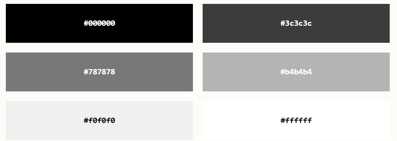

## 什么是
- CSS 是层叠样式表 (Cascading Style Sheets)
- CSS 描述了如何在屏幕、纸张或其他媒体上显示 HTML 元素

## 为何使用
- CSS 用于定义网页的样式，包括针对不同设备和屏幕尺寸的设计和布局。

## css使用
__外部__
```css
<link rel="stylesheet" type="text/css" href="mystyle.css">
```
__内部__
```html
<!DOCTYPE html>
<html>
<head>
<style>
body {
  background-color: linen;
}

h1 {
  color: maroon;
  margin-left: 40px;
} 
</style>
</head>
<body>

<h1>标题</h1>
< p>内容</p>

</body>
</html>
```

__行内__
```html
<!DOCTYPE html>
<html>
<body>

<h1 style="color:blue;text-align:center;">This is a heading</h1>
< p style="color:red;">This is a paragraph.</p>

</body>
</html>
```

### 样式叠加时优先级
- 行内样式（在 HTML 元素中）
- 外部和内部样式表（在 head 部分）
- 浏览器默认样式


  

## 选择器
### 种类
- 简单选择器（根据名称、id、类来选取元素）
- 组合器选择器（根据它们之间的特定关系来选取元素）
- 伪类选择器（根据特定状态选取元素）
- 伪元素选择器（选取元素的一部分并设置其样式）
- 属性选择器（根据属性或属性值来选取元素）

#### 元素选择器
- 根据元素名称来选择 HTML 元素
  
```css
/* 页面上的所有 < p> 元素都将居中对齐，并带有红色文本颜色 */
p {
  text-align: center;
  color: red;
}
```

#### id选择器
- 使用id属性来选择元素
  
```css
/* id="para1" 的 HTML 元素 */
#para1 {
  text-align: center;
  color: red;
}
```

#### 类选择器
- 用类名来选择元素

```css
/* class="center" 的 HTML 元素 */
.center {
  text-align: center;
  color: red;
}
```

#### 通用选择器
- 所有的 HTML 元素

```css
* {
  text-align: center;
  color: blue;
}
```

#### 分组选择
- 例子 
```css
h1, h2, p {
  text-align: center;
  color: red;
}
```

#### 伪类
- 定义元素的特殊状态

```css
/* 未访问的链接 */
a:link {
  color: #FF0000;
}

/* 已访问的链接 */
a:visited {
  color: #00FF00;
}

/* 鼠标悬停链接 */
a:hover {
  color: #FF00FF;
}

/* 已选择的链接 */
a:active {
  color: #0000FF;
}
```

##### 所有伪类
|选择器 | 例子 | 例子描述|
|-|-|-|
|:active | a:active | 选择活动的链接。|
|:checked | input:checked | 选择每个被选中的 \<input\> 元素。|
|:disabled | input:disabled | 选择每个被禁用的 \<input\> 元素。|
|:empty | p:empty | 选择没有子元素的每个 \< p\> 元素。|
|:enabled | input:enabled | 选择每个已启用的 \<input\> 元素。|
|:first-child | p:first-child | 选择作为其父的首个子元素的每个 \< p\> 元素。|
|:first-of-type | p:first-of-type | 选择作为其父的首个 \< p\> 元素的每个 \< p\> 元素。|
|:focus | input:focus | 选择获得焦点的 \<input\> 元素。|
|:hover | a:hover | 选择鼠标悬停其上的链接。|
|:in-range | input:in-range | 选择具有指定范围内的值的 \<input\> 元素。|
|:invalid | input:invalid | 选择所有具有无效值的 \<input\> 元素。|
|:lang(language) | p:lang(it) | 选择每个 lang 属性值以 "it" 开头的 \<\p\> 元素。|
|:last-child | p:last-child | 选择作为其父的最后一个子元素的每个 \< p\> 元素。|
|:last-of-type | p:last-of-type | 选择作为其父的最后一个 \< p\> 元素的每个 \< p\> 元素。|
|:link | a:link | 选择所有未被访问的链接。|
|:not(selector) | :not(p) | 选择每个非 \< p\> 元素的元素。|
|:nth-child(n) | p:nth-child(2) | 选择作为其父的第二个子元素的每个 \< p\> 元素。|
|:nth-last-child(n) | p:nth-last-child(2) | 选择作为父的第二个子元素的每个\< p\>元素，从最后一个子元素计数。|
|:nth-last-of-type(n) | p:nth-last-of-type(2) | 选择作为父的第二个\< p\>元素的每个\< p\>元素，从最后一个子元素计数|
|:nth-of-type(n) | p:nth-of-type(2) | 选择作为其父的第二个 \< p\> 元素的每个 \< p\> 元素。|
|:only-of-type | p:only-of-type | 选择作为其父的唯一 \< p\> 元素的每个 \< p\> 元素。|
|:only-child | p:only-child | 选择作为其父的唯一子元素的 \< p\> 元素。|
|:optional | input:optional | 选择不带 "required" 属性的 \<input\> 元素。|
|:out-of-range | input:out-of-range | 选择值在指定范围之外的 \<input\> 元素。|
|:read-only | input:read-only | 选择指定了 "readonly" 属性的 \<input\> 元素。|
|:read-write | input:read-write | 选择不带 "readonly" 属性的 \<input\> 元素。|
|:required | input:required | 选择指定了 "required" 属性的 \<input\> 元素。|
|:root | root | 选择元素的根元素。|
|:target | #news:target | 选择当前活动的 #news 元素（单击包含该锚名称的 URL）。|
|:valid | input:valid | 选择所有具有有效值的 \<input\> 元素。|
|:visited | a:visited | 选择所有已访问的链接。|

#### 伪元素选择器
- 设置元素指定部分的样式
- 元素的首字母、首行的样式
- 元素的内容之前或之后插入内容
  

__例子__

```css
/* 下面的例子设置所有 < p> 元素中文本的首字母格式： */
p::first-line {
  color: #ff0000;
  font-variant: small-caps;
}

/* 以红色和较大的字体显示 class="intro" 的段落的首字母 */
p.intro::first-letter {
  color: #ff0000;
  font-size: 200%;
}
```
- 多个伪元素可以组合

|选择器 | 例子 | 例子描述|
|-|-|-|
|::after | p::after | 在每个 \< p\> 元素之后插入内容。|
|::before | p::before | 在每个 \< p\> 元素之前插入内容。|
|::first-letter | p::first-letter | 选择每个 \< p\> 元素的首字母。|
|::first-line | p::first-line | 选择每个 \< p\> 元素的首行。|
|::selection | p::selection | 选择用户选择的元素部分。|


#### 属性选择器
- 设置带有特定属性或属性值的 HTML 元素的样式
- CSS [attribute="value"] 选择器

```css
/* 下例选取所有带有 target="_blank" 属性的 < a > 元素 */
a[target="_blank"] { 
  background-color: yellow;
}
```

- CSS [attribute~="value"] 选择器
```css
/* 选取 title 属性包含 "flower" 单词的所有元素 */
[title~="flower"] {
  border: 5px solid yellow;
}
```

- CSS [attribute^="value"] 选择器 -> 选取指定属性以指定值开头的元素。
```css
<!-- 选取 class 属性以 "top" 开头的所有元素 -->
[class^="top"] {
  background: yellow;
}
```

- [attribute$="value"] 选择器 选取指定属性以指定值结尾的元素
- [attribute*="value"] 选择器 选取属性值包含指定词的元素。

|选择器 | 例子 | 例子描述|
|-|-|-|
|[attribute] | [target] | 选择带有 target 属性的所有元素。|
|[attribute=value] | [target=_blank] | 选择带有 target="_blank" 属性的所有元素。|
|[attribute~=value] | [title~=flower] | 选择带有包含 "flower" 一词的 title 属性的所有元素。|
|[attribute\|=value] | [lang\|=en] | 选择带有以 "en" 开头的 lang 属性的所有元素。|
|[attribute^=value] | a[href^="https"] | 选择其 href 属性值以 "https" 开头的每个 < a > 元素。|
|[attribute$=value] | a[href$=".pdf"] | 选择其 href 属性值以 ".pdf" 结尾的每个 < a > 元素。|
|[attribute*=value] | a[href*="w3school"] | 选择其 href 属性值包含子串 "w3school" 的每个 < a > 元素。|


## 颜色设置

###  RGB / RGBA
- _rgb(red, green, blue)_
- rgba(red, green, blue, alpha)
  
### HEX颜色
- 十六进制颜色值
- #rrggbb



### HSL 
色相、饱和度和明度（HSL）来指定颜色
_hsla(hue, saturation, lightness)_

- 色相（hue）是色轮上从 0 到 360 的度数。0 是红色，120 是绿色，240 是蓝色。
- 饱和度（saturation）是一个百分比值，0％ 表示灰色阴影，而 100％ 是全色。
- 亮度（lightness）也是百分比，0％ 是黑色，50％ 是既不明也不暗，100％是白色。


## 背景设置
- background-color
- background-image
- background-repeat
- background-attachment
- background-position

### background-color
```css
h1 {
  background-color: green;
}

div {
  background-color: lightblue;
}

p {
  background-color: yellow;
}
```

### background-image
```css
body {
  background-image: url("bgdesert.jpg");
}
```

### background-repeat
默认情况下，background-image 属性在水平和垂直方向上都重复图像
```css
body {
  background-image: url("gradient_bg.png");
  /* 水平方向重复 */
  background-repeat: repeat-x;
}
```
